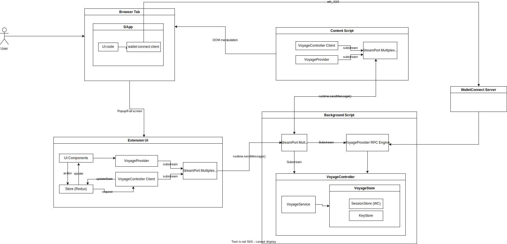

## Overview

This repository contains the code for the Voyage core web extension. For details, refer to the [RFC](https://www.notion.so/RFC-003-Voyage-Extension-v1-3cb5e310977442e08d1f3f0ea137207f).

## Getting Started

```shell
npm i
npm run start
```

## Stack
* TypeScript
* React 17
* Webpack 5
* Manifest version 3
* Mantine

# Available Scripts

In the project directory, you can run:

### `npm start`

Runs the app in development mode. All compiled assets will be in `build`. To preview the extension, load it into Chrome.

Note that the extension, including background and content scripts, are automatically hot reloaded thanks to [@voyage-finance/webpack-ext-loader](https://github.com/voyage-finance/webpack-ext-reloader), our fork of [SimplifyJob/webpack-ext-reloader](https://github.com/SimplifyJobs/webpack-ext-reloader).

### `npm test`

Launches the test runner in the interactive watch mode.\
See the section about [running tests](https://facebook.github.io/create-react-app/docs/running-tests) for more information.

### `npm run build`

Builds the app for production to the `build` folder.\
It correctly bundles React in production mode and optimizes the build for the best performance.

The build is minified and the filenames include the hashes.\

## Architecture



Voyage Extension has a few major components:
* UI -- React code that powers the popup and tab views. Communicates with background using `PortStream` + `ObjectMultiplex`
* Background -- houses `VoyageController`, the central API for both UI and `contentscript`
* ContentScript -- enables the extension to manipulate the DOM. Communicates with backgound using `PortStream` + `ObjectMultiplex`

### Voyage Controller

